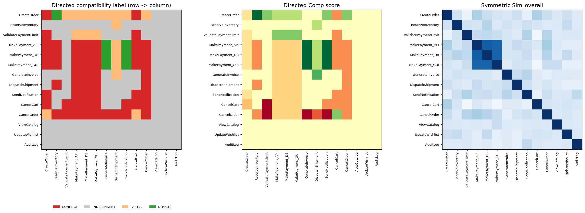
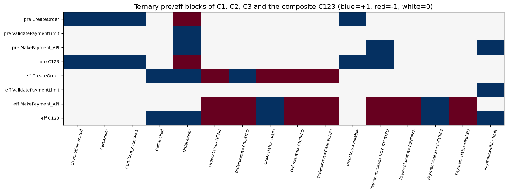
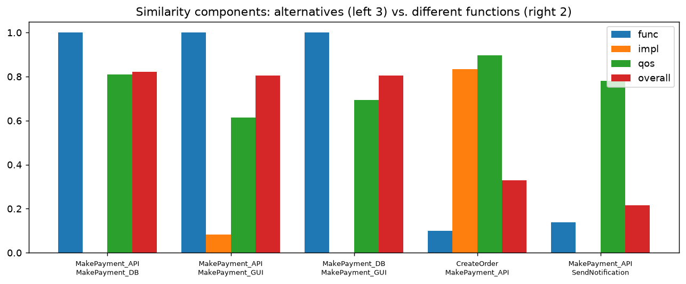
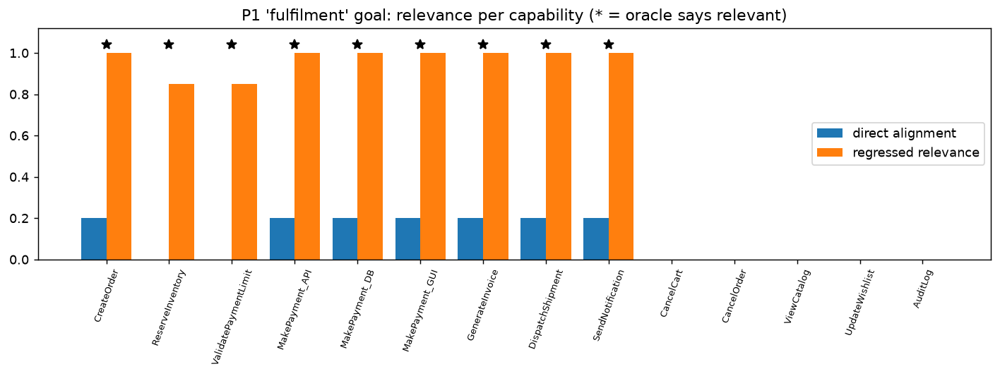
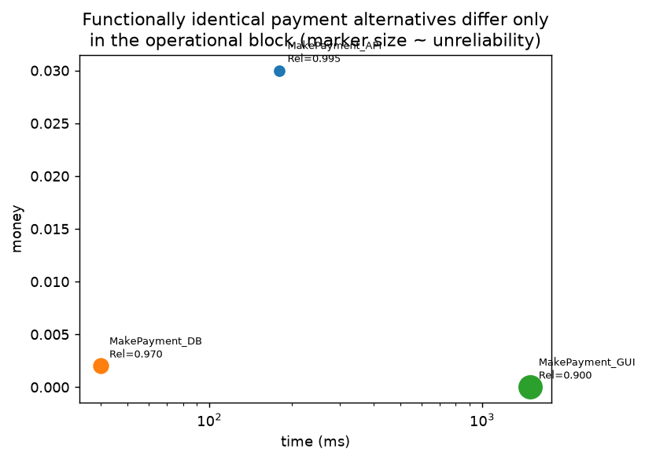
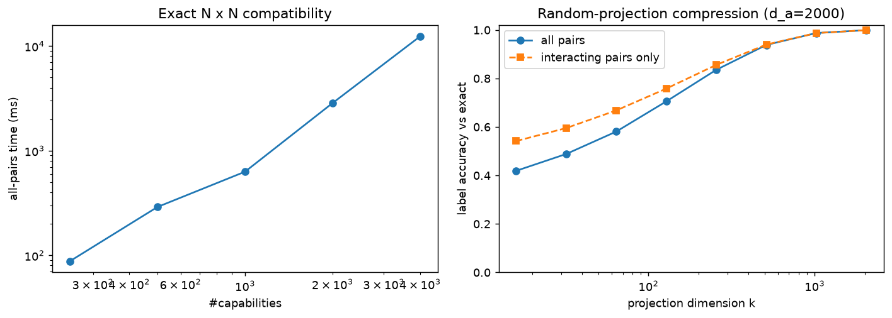

# 1. Problem definition

Assignment 1 searched for a *sequence* of transitions that turns an initial state into a goal state. This assignment asks a
different question: **how should the operations themselves — the capabilities — be represented** so that the structure of a
formally specified application can be read off a vector space?

A formally specified application is $A=(S,C,S_I,G,R,K)$ and a capability is
$C_i=(T_i,I_i,O_i,P_i,E_i,K_i,R_i,Q_i,\mathrm{Rel}_i,A_i,M_i)$. The task is to design embeddings of states, goals and
capabilities such that the vector space preserves

* which capabilities **can follow which** (precondition–effect and input–output compatibility),
* which capabilities are **functionally alike** (and that alike $\neq$ composable),
* how simple capabilities **compose** into complex ones,
* which capabilities are **relevant to a goal**, and
* how **cost, reliability, availability, risk, constraints and resources** should be represented.

**Primary research question.** *How can formally specified states, goals and executable capabilities be represented in a vector
space such that the representation preserves the relationships required for capability compatibility, composition, and the
construction of complex application functionality?*

**Scope.** Planning and replanning (BFS/DFS/A\*/D\* Lite/LPA\*) are outside the scope. No planner is part of the proposed
system. (A brute-force reachability routine is used *only* to generate ground-truth labels for Experiment 4; it is not part of
the embedding or its API.)

**Hypothesis.** A *problem-specific, structured* embedding — in which each formal component occupies its own block and
composition is defined block by block — can make compatibility, composition and goal relevance *computable by linear algebra*
and *exactly faithful to execution semantics*, whereas a purely semantic (text-style) embedding cannot.

# 2. Design requirements

From the assignment (Sections 6–8) and the discussion of what an embedding must do, the design is held to these requirements.

| id | requirement | how it is tested |
|---|---|---|
| R1 | **Identity** – functionally different capabilities get different vectors | distinctness; Exp. 3 |
| R2 | **State awareness** – states and capabilities live in one space; a capability acts on a state | vector-vs-concrete execution (Exp. 2b) |
| R3 | **Precondition–effect compatibility** – $E_i\Rightarrow P_j$ is detectable, conflicts too | Exp. 1 vs oracle |
| R4 | **Input–output compatibility** – typed data dependencies, with domain subsumption | ablation (Exp. 1) |
| R5 | **Similarity ≠ composability** – both exist, are different, and similarity is explained | Exp. 1 (AUC), Exp. 3 |
| R6 | **Composition** – a composite is a point in the same space, with algebraic laws | Exp. 2 |
| R7 | **Goal relevance** – relation to a goal, including capabilities that are only *indirectly* useful | Exp. 4 |
| R8 | **Operational properties** – a justified choice of embedded vs separate | Exp. 5 |
| R9 | **Interpretability / verifiability** – every coordinate has a meaning, so claims can be checked against execution | tests |
| R10 | **Efficiency** – storage and computation reported | §9.8 |
| R11 | **Consistency** – same behaviour on different problems | §9.7 |

Two derived design principles: (P-a) *no information required for a decision may be hidden in a lossy average*; (P-b) *a
property that belongs to one decision must not leak into another* (e.g. latency must not change compatibility).

# 3. Related embedding approaches

| approach | what it embeds | strengths | limitation for this task |
|---|---|---|---|
| **Word2Vec / GloVe** (Mikolov et al. 2013; Pennington et al. 2014) | words by co-occurrence; analogies are vector offsets | captures *semantic* similarity from data | similarity is symmetric and distributional; says nothing about preconditions/effects, so "CreateOrder" and "CancelOrder" look close though they conflict |
| **Contextual / sentence encoders** (BERT, Sentence-BERT: Devlin et al. 2019; Reimers & Gurevych 2019) | text passages | strong semantic retrieval | needs natural language; capabilities here are *formal*; no guarantee on logical relations; not exact or composable |
| **Knowledge-graph embeddings** (TransE: Bordes et al. 2013) | entities and relations as translations $h+r\approx t$ | relational structure, compositional-looking offsets | learned from triples; approximate; relations are not typed state transitions; no guarantees under composition |
| **Graph/walk embeddings** (DeepWalk, node2vec: Perozzi et al. 2014; Grover & Leskovec 2016) | nodes from random walks | neighbourhood structure | needs a graph first (here, the graph is the *output* we want); symmetric proximity |
| **Tensor-product / holographic / hyper-dimensional representations** (Smolensky 1990; Plate 1995; Kanerva 2009) | structured symbols bound into vectors | explicit binding gives compositional structure; approximate unbinding | dense random codes are lossy; cannot decide "all preconditions satisfied" exactly without cleanup |
| **STRIPS/PDDL representation** (Fikes & Nilsson 1971) | actions as pre/add/delete sets | exact semantics | symbolic, not a vector space; no similarity/metric structure |
| **Semantic-web-service matchmaking** (OWL-S; Paolucci et al. 2002) | I/O/P/E concepts in ontologies, degrees of match (exact / plug-in / subsumes / fail) | the *directional degrees of match* idea | logic-based (reasoner), no vector representation, no algebra of composition |
| **QoS-aware composition** (Zeng et al. 2004) | aggregation rules for time, cost, reliability | sum / product / min rules per attribute | operational only; not linked to functional compatibility |

**Take-away.** Distributed *semantic* embeddings give similarity but not compatibility; symbolic planning formalisms give exact
compatibility but no vector space. The design below keeps what is exact in the symbolic formalisms (ternary literal vectors;
STRIPS-like effects with saturation), borrows the *degrees of match* idea from service matchmaking (CONFLICT / INDEPENDENT /
PARTIAL / STRICT), borrows the aggregation laws from QoS composition (as a monoid block), and uses the vector form to make all
of it computable by inner products and to give similarity a metric structure. The chosen approach is **adapted and combined**,
not an off-the-shelf model.

# 4. Proposed representation

**TAPCE — Typed-Atom Partitioned Capability Embedding.**

1. *Ground* all typed state variables into atoms (Boolean; one per enum value; one per integer cut-point $n\ge c$).
2. *States* are complete bipolar vectors over atoms; *goals*, *preconditions*, *constraints* and *effects* are ternary vectors
   ($+1$ must/does hold, $-1$ must not/does not hold, $0$ unconstrained/unchanged).
3. *Data dependencies* are port vectors; outputs are closed under the domain hierarchy so subsumption is an inner product.
4. A capability is a **partitioned vector** of functional blocks $(p,\kappa,e,\mathbf i,\mathbf o)$, implementation blocks
   $(\tau,\mu,\rho)$ and operational blocks $(q^+,q^\circ)$ — 206 dimensions for the checkout problem, $\approx$0.8 KB.
5. *Compatibility* is directed (inner products on dual-rail splits); *similarity* is symmetric (block cosines);
   *composition* is block-wise and algebraically lawful.

Design decisions the assignment explicitly asks to be settled:

* **Type and mechanism** are embedded, but in their own low-weight blocks that influence *implementation similarity only*;
  mechanism details are signed-hashed (no vocabulary needed). They never influence compatibility, validity or goal relevance.
* **Reliability** is embedded as $-\ln\mathrm{Rel}$ in an additive block (so it composes by addition) but kept apart from the semantic blocks.
* **Availability** is a min/max block; **cost, risk** are additive; **resources** are a set (union); **constraints** are a ternary guard block in the state-atom space.
* **Separate representations** are used where the decision differs: the semantic/functional blocks decide compatibility;
  the operational blocks only *filter and rank* functionally acceptable candidates.

The full mathematical specification is Deliverable 1; the following section recalls the parts needed to read the results.

# 5. Mathematical formulation (summary)

*Operators.* $(u\sqcup w)_k=u_k$ if $u_k\ne0$ else $w_k$ (merge requirements); $(u\oplus w)_k=w_k$ if $w_k\neq0$ else $u_k$ (override/apply).
$\sigma$ adds typing-implied literals (enum exclusivity, integer monotonicity).

*Embeddings.* $\phi_S(S)=\sigma(\bigoplus\alpha(x{:=}v))$; $\phi_G(G)=\bigsqcup\ell(g)$;
$\phi_C(C)=(p,\kappa,e,\mathbf i,\mathbf o,\tau,\mu,\rho,q^+,q^\circ)$; requirement $r=p\sqcup\kappa$; guarantee $g=e\oplus\sigma(r)$.

*State transition.* $\phi_S(\mathrm{Apply}(S,E))=\phi_S(S)\oplus e$. *Applicable* iff every non-zero entry of $r$ is matched by the state.

*Compatibility* $A\to B$ with optional context $(s_0,\mathbf m)$, $\hat g=g_A\sqcup s_0$:
$\mathrm{match}=\langle\hat g^+,r_B^+\rangle+\langle\hat g^-,r_B^-\rangle$, $\mathrm{conflict}=\langle\hat g^+,r_B^-\rangle+\langle\hat g^-,r_B^+\rangle$,
$\mathrm{supply}$ = the same with only $A$'s genuinely new effects, and the analogous port coverage. Labels:
CONFLICT (any conflict) $>$ INDEPENDENT (nothing supplied) $>$ STRICT (all needs covered) $>$ PARTIAL.

*Similarity.* $\mathrm{Sim}=0.70\,\mathrm{Sim}_{func}+0.15\,\mathrm{Sim}_{impl}+0.15\,\mathrm{Sim}_{qos}$ with block-weighted cosines.

*Composition.* $p_{Y\circ X}=p_X\sqcup(p_Y\odot\mathbb 1[e_X=0])$, $e_{Y\circ X}=e_X\oplus e_Y$,
$\mathbf i_{Y\circ X}=\max(\mathbf i_X,\mathbf i_Y\odot(1-\mathbf o_X))$, $q^+$ adds, $q^\circ=(\min,\max,\min)$; valid iff $r_Y$ does not
contradict $g_X$.

*Goal relevance.* Direct alignment $\mathrm{align}$ and backward *regressed relevance* $\lambda^{\mathrm{depth}}$ (a fixed-point
over need-vectors; not a plan search).

# 6. Capability composition model

Composition is the central object, so its model is stated separately.

**What a composite is.** $\mathrm{CompletePurchase}=\mathrm{MakePayment}\circ\mathrm{ValidatePaymentLimit}\circ\mathrm{CreateOrder}$ is a
capability with its own $(p,\kappa,e,\mathbf i,\mathbf o,\dots)$: its preconditions are only what the *chain as a whole* needs from the
outside world; its effects are the net state change; its inputs are only the data not produced inside the chain; its operational
block is the monoid sum. It is encoded in the *same* space, so it can be passed to `similarity`, `compat`, `apply` or `compose` again.

**Why not average the parts?** Pooling the component vectors loses exactly the information composition changes: it
re-includes preconditions that an earlier step already satisfies, double-counts overwritten effects, and cannot express
"conflict in the middle of the chain". §9.2 quantifies this.

**Laws.** Closure; associativity; an identity element; *soundness w.r.t. execution* (the composite is applicable in a state iff the chain
runs from it, and gives the same final state); QoS homomorphism (time/money/energy add; reliability multiplies; windows intersect).
All are checked mechanically (§9.2).

**Relationship between the composite vector and its components** (CompletePurchase of Experiment 2): the composite
effect vector is dominated by the *last* writer, the composite precondition vector is the union of the components' external
requirements *minus* what the chain establishes internally; the operational block is exactly the sum of the components' blocks.
Consequently the composite is *not* near the centroid of its parts: $\cos(\text{pre}_{MakePayment},\text{pre}_{C123})=0$ because every
`MakePayment` precondition is satisfied internally, while $\cos(\text{eff}_{MakePayment},\text{eff}_{C123})=0.87$.

# 7. Implementation

Python 3.12 with NumPy (Deliverable 2). The library exposes `encode`, `compose`, `similarity` plus `compat`, `compat_matrix`, `apply`,
`goal_relevance`, `availability`, `utility`, `global_violations`. Structure: `spec.py` (formal model), `atoms.py` (grounding,
saturation), `embedding.py` (the representation), `semantics.py` (independent concrete-value oracle — evaluation only),
`verify.py` (property checks). 21 automated tests pass. Compatibility for all pairs is computed with four matrix products.

# 8. Experimental methodology

**Problems.** Four formal problems (Deliverable 3): P0 (the exact C1/C2/C3 pattern of the assignment), P1 e-commerce checkout
(14 capabilities), P2 ML pipeline (15), P3 loan approval (13). They cover all nine capability types, Boolean/enum/integer variables,
domain-subsuming ports, and every operational attribute.

**Ground truth (independent of the embedding).**
*Pair relation* — for each ordered pair the oracle enumerates concrete valuations of the variables the two capabilities read
(Booleans, enum values, integers at every cut-point $\pm1$) and applies the capabilities with concrete semantics:
CONFLICT if no valuation allows B right after A; INDEPENDENT if A never changes whether B is applicable and supplies no data;
STRICT if B is *always* applicable after A (and A covers B's inputs); PARTIAL otherwise.
*Goal relevance* — a capability is relevant iff it occurs in some irredundant goal-reaching sequence found by exhaustive search.
*Composition* — chains are executed step by step on concrete states.

**Baselines.** (i) *Text embedding*: TF-IDF cosine over the capability name/description — a lexical stand-in for a
Word2Vec/Sentence-style *semantic* embedding (no pre-trained model was available offline); (ii) naive dot product $\langle e_A,p_B\rangle$
(the simplest "embedding" compatibility); (iii) mean-pool and sum-pool composition; (iv) ablations of saturation, persistence
and ports; (v) direct goal alignment and $\cos(e,\gamma)$ for relevance.

**Metrics.** label accuracy (4-class), AUC, precision/recall/F1, mismatches against concrete execution, retrieval precision@k,
bytes and seconds. Random seeds are fixed; every number below is copied from `results/RESULTS.md`, produced by `experiments/run_all.py`.

# 9. Results

## 9.1 Experiment 1 — Capability compatibility

*The pattern of the assignment (P0).*

| pair | label | Comp score | coverage | conflict | $\mathrm{Sim}_{func}$ | $\mathrm{Sim}$ |
|---|---|---|---|---|---|---|
| CreateOrder → MakePayment | **STRICT** | +1.00 | 1.00 | 0.00 | 0.00 | 0.23 |
| CreateOrder → CancelCart | **CONFLICT** | −1.00 | 0.00 | 1.00 | 0.00 | 0.25 |
| MakePayment → CreateOrder | INDEPENDENT | 0.00 | 1.00 | 0.00 | 0.00 | 0.23 |

C1→C2 is compatible and C1→C3 is incompatible, as required — and the *similarity* of the two pairs is essentially the same
($0.23$ vs $0.25$): similarity cannot make the distinction, compatibility does.

*All ordered pairs vs the concrete-semantics oracle.*

| problem | ordered pairs | label accuracy | CONFLICT | INDEPENDENT | PARTIAL | STRICT |
|---|---|---|---|---|---|---|
| P1 checkout | 182 | **1.000** | 51 | 106 | 18 | 7 |
| P2 ML pipeline | 210 | **1.000** | 11 | 181 | 9 | 9 |
| P3 loan | 156 | **1.000** | 15 | 127 | 8 | 6 |

*Ablations* (label accuracy vs oracle) show every ingredient is needed:

| problem | full | no saturation | no persistence | no ports | none of the three | naive $\langle e,p\rangle$ |
|---|---|---|---|---|---|---|
| P1 | 1.000 | 0.951 | 0.802 | 0.984 | 0.802 | 0.802 |
| P2 | 1.000 | 1.000 | 0.967 | 0.990 | 0.957 | 0.948 |
| P3 | 1.000 | 0.962 | 0.942 | 0.987 | 0.929 | 0.929 |

{width=100%}

*Similarity is not composability.* AUC for predicting "A can feed B" (STRICT or PARTIAL vs the rest):

| problem | text-sim (lexical stand-in) | cosine of flat embedding | $\mathrm{Sim}$ (overall) | **directed Comp** | pairs with asymmetric label |
|---|---|---|---|---|---|
| P1 | 0.674 | 0.645 | 0.632 | **0.959** | 31 % |
| P2 | 0.677 | 0.554 | 0.532 | **0.869** | 18 % |
| P3 | 0.649 | 0.548 | 0.521 | **0.904** | 18 % |

## 9.2 Experiment 2 — Capability composition

Chain $C_1\to C_2\to C_3$ = CreateOrder → ValidatePaymentLimit → MakePayment_API, composite $C_{123}$:

* external **preconditions**: `User.authenticated, Cart.exists, Cart.item_count>=1, NOT Order.exists, Inventory.available, Payment.status=NOT_STARTED` (+ guard `role ≠ GUEST`). `Order.exists` and `Payment.within_limit` are *gone*: the chain establishes them itself.
* **effects**: `Order.exists, Cart.locked, Payment.within_limit, Order.status=PAID, Payment.status=SUCCESS` (and the implied negations).
* external **inputs**: `cart_id, amount, payment_token`; **outputs**: `order_id, limit_token, payment_id`.
* operational block: time 248 ms, money 0.04, reliability 0.9935, risk 0.0347, resources {AuthToken, Database, Network, PaymentGateway}.

{width=100%}

| component | cos(flat, C123) | $\mathrm{Sim}_{func}(\cdot,C_{123})$ | cos(eff, eff$_{123}$) | cos(pre, pre$_{123}$) |
|---|---|---|---|---|
| CreateOrder | 0.648 | 0.598 | 0.327 | 0.913 |
| ValidatePaymentLimit | 0.218 | 0.164 | 0.289 | −0.408 |
| MakePayment_API | 0.689 | 0.640 | 0.866 | 0.000 |

*Algebraic soundness* (random chains of length 2–4, guided and unguided; random + witness states):

| problem | vector vs concrete apply (mismatches / trials) | composite vs sequential execution | associativity (blocks equal) | identity |
|---|---|---|---|---|
| P0 | 0 / 660 | 0 / 7 610 | 400 / 400 | 3 / 3 |
| P1 | 0 / 3 080 | 0 / 8 310 | 400 / 400 | 14 / 14 |
| P2 | 0 / 3 300 | 0 / 9 560 | 400 / 400 | 15 / 15 |
| P3 | 0 / 2 860 | 0 / 9 900 | 400 / 400 | 13 / 13 |

*Pooling baselines* (agreement of composite applicability and final state with sequential execution):

| problem | **algebraic composition** | mean-pool + sign | sum-pool + clip |
|---|---|---|---|
| P1 | **1.000** | 0.870 | 0.870 |
| P2 | **1.000** | 0.807 | 0.807 |
| P3 | **1.000** | 0.874 | 0.874 |

*Closure.* The composite is used as an ordinary capability: $C_{123}\to$ SendNotification is STRICT, $\to$ GenerateInvoice STRICT,
$\to$ CancelOrder CONFLICT ($-0.5$: its `Order.exists` precondition holds, its `Payment ≠ SUCCESS` precondition is violated),
$\to$ AuditLog INDEPENDENT — the same labels as the last component alone. *State/data awareness:* CreateOrder → ValidatePaymentLimit is
PARTIAL context-free (the `amount` input is not produced by CreateOrder) but STRICT once the initial state and environment data are supplied.
Executed purely in vector space from $S_I$, CompletePurchase = CreateOrder → ValidatePaymentLimit → MakePayment_API → SendNotification
is applicable at every step and ends with goal progress 1.00. In $S_I$ the applicable capabilities are CreateOrder, CancelCart, ViewCatalog,
UpdateWishlist, AuditLog.

## 9.3 Experiment 3 — Alternative implementations

| problem | alternatives | $\mathrm{Sim}_{func}$ | $\mathrm{Sim}_{impl}$ | $\mathrm{Sim}_{qos}$ | $\mathrm{Sim}$ | ‖flat diff‖ | compat(a→b) |
|---|---|---|---|---|---|---|---|
| P1 | MakePayment_API ~ _DB | **1.00** | 0.00 | 0.81 | 0.82 | 0.56 | CONFLICT |
| P1 | MakePayment_API ~ _GUI | **1.00** | 0.08 | 0.61 | 0.80 | 0.56 | CONFLICT |
| P1 | MakePayment_DB ~ _GUI | **1.00** | 0.00 | 0.69 | 0.80 | 0.57 | CONFLICT |
| P2 | LoadCSV ~ LoadParquetS3 | 0.59 | 0.00 | 0.97 | 0.56 | 0.90 | CONFLICT |
| P2 | TrainModel_GPU ~ _CPU | **1.00** | 0.70 | 0.64 | 0.90 | 0.36 | INDEPENDENT |
| P3 | VerifyIdentity_API ~ _Manual | **1.00** | 0.00 | 0.53 | 0.78 | 0.59 | CONFLICT |

{width=85%}

* Implementations of the same function have $\mathrm{Sim}_{func}=1$ (identical pre/eff/ports), yet their flat vectors are **not** identical
  (distance 0.36–0.90) because type, mechanism, resources and QoS differ — the embedding does not collapse them.
* *Control — same type, different function*: mean $\mathrm{Sim}_{func}$ is only 0.02–0.03 although $\mathrm{Sim}_{impl}$ is 0.60–0.79. So **type does not dominate**.
* LoadCSV/LoadParquetS3 differ functionally too (they leave the data in different formats), and the embedding reports it ($\mathrm{Sim}_{func}=0.59$).
* Alternatives *conflict* when composed (paying twice is blocked by `Payment.status=NOT_STARTED`): **high similarity, no composability**.

*Retrieval of alternatives* (precision@k, $k$ = group size − 1):

| problem | $\mathrm{Sim}_{func}$ | $\mathrm{Sim}_{impl}$ only | $\mathrm{Sim}$ | text TF-IDF |
|---|---|---|---|---|
| P1 | 1.00 | 0.00 | 1.00 | 0.83 |
| P2 | 1.00 | 0.50 | 1.00 | 1.00 |
| P3 | 1.00 | 0.00 | 1.00 | 1.00 |

The text baseline does well on P2/P3 because the capability names share a prefix (`TrainModel_*`, `VerifyIdentity_*`); this is a lexical artefact, not evidence that
it understands function. Implementation similarity alone does *not* recover alternatives (0.00 on P1/P3), which is why implementation information is kept in a separate block.

## 9.4 Experiment 4 — Irrelevant capabilities and goal relevance

Precision / recall / F1 for "capability is relevant to the goal" against the irredundant-sequence oracle:

| problem/goal | direct alignment (F1) | **regressed relevance** P / R / F1 | cos(eff, goal)>0 (F1) | text TF-IDF, best threshold (F1) |
|---|---|---|---|---|
| P1 / main | 0.91 | **1.00 / 1.00 / 1.00** | 0.91 | 0.71 |
| P1 / fulfilment | 0.88 | **1.00 / 1.00 / 1.00** | 0.88 | 0.86 |
| P2 / main | 0.33 | **1.00 / 1.00 / 1.00** | 0.33 | 0.84 |
| P2 / train_only | 0.44 | **1.00 / 1.00 / 1.00** | 0.44 | 0.67 |
| P3 / main | 0.33 | 0.91 / 1.00 / **0.95** | 0.33 | 0.87 |
| P3 / decline | 0.40 | **1.00 / 1.00 / 1.00** | 0.40 | 0.76 |

{width=90%}

* Direct alignment has perfect precision but low recall: it only sees capabilities whose *effects* hit the goal, so early pipeline steps
  (e.g. `LoadCSV`, `CleanData`) look irrelevant. Regressed relevance recovers them by propagating needs backward through preconditions and data.
* Distractors (`ViewCatalog`, `UpdateWishlist`, `AuditLog`, `ClearTempFiles`, `CompressLogs`, `PlotTSNE`, `ArchiveRecords`, `UpdateMarketingPrefs`, `ConvertToParquet`) are never flagged.
* **Goal-dependence works:** with the extended goal *fulfilment*, `ReserveInventory`, `GenerateInvoice` and `DispatchShipment` change from irrelevant to relevant, as the oracle says.
* `CancelOrder` is flagged *harmful* (it contradicts the goal literal `Order.exists`).
* **The one error:** for P3/main, `DeclineLoan` is flagged relevant (false positive) because it supplies "decision ≠ PENDING", which `SendDecisionEmail` needs; but it makes `ApproveLoan` impossible. Backward propagation is order-agnostic and does not see mutual exclusion between alternatives (see §11).
* Relevance is state-aware: with an unknown state (`no state`) the P1/P2/P3 scores are unchanged here, since none of the initial-state facts removes a supplier.

## 9.5 Experiment 5 — Operational attributes

*(a) The operational block composes by monoid folds and matches simulation* (200 000 Monte-Carlo runs with independent Bernoulli success/risk):

| problem | chain | time ms | money | Rel vector | Rel MC | risk vector | risk MC |
|---|---|---|---|---|---|---|---|
| P1 | CreateOrder…SendNotification | 273 | 0.041 | 0.9925 | 0.9926 | 0.0443 | 0.0440 |
| P2 | LoadCSV…TrainModel_GPU | 27 440 | 0.400 | 0.9450 | 0.9455 | 0.0823 | 0.0826 |
| P3 | SubmitApplication…FetchCreditScore | 5 700 | 1.250 | 0.9509 | 0.9508 | 0.0965 | 0.0959 |

*(b) No leakage into compatibility.* Re-scaling every cost, reliability and risk value at random (20 trials): compatibility labels were identical in **20/20**;
$\mathrm{Sim}_{func}$ changed by $0.0000$; only $\mathrm{Sim}$ changed (mean $|\Delta|=0.006$, via the 15 % QoS part).

*(c) A scalarised preference selects among functionally identical alternatives* ($U=w^\top\tilde q$):

| group | latency-first | cost-first | reliability/risk-first |
|---|---|---|---|
| P1 payment | MakePayment_DB | MakePayment_DB | MakePayment_API |
| P2 train | TrainModel_GPU | TrainModel_CPU | TrainModel_CPU |
| P3 verify | VerifyIdentity_API | VerifyIdentity_API | VerifyIdentity_Manual |
| P2 load | LoadCSV | LoadCSV | LoadCSV |

{width=55%}

*(d) Availability and resources.* At 23:00 the GUI payment (window 08–22) drops out; a composite containing it inherits the window
[8, 22] and is unavailable at 23:00. With `MakePayment_API` unavailable the top functional substitutes are `MakePayment_GUI` and `MakePayment_DB` (both
$\mathrm{Sim}_{func}=1.0$). Without a GPU in the environment `TrainModel_GPU` is infeasible and `TrainModel_CPU` is the best functional substitute.
At 20:00 `VerifyIdentity_Manual` (09–17) is unavailable and `VerifyIdentity_API` is the substitute.

*(e) Constraints.* The guard block blocks a capability whose functional preconditions hold, exactly as concrete semantics does:

| scenario | capability | pre only (cov/conf) | pre + guards | vector applicable | concrete applicable |
|---|---|---|---|---|---|
| loan amount 80 000 | ApproveLoan | 1.00/0.00 | 0.80/0.20 | False | False |
| loan amount 20 000 | ApproveLoan | 1.00/0.00 | 1.00/0.00 | True | True |
| role GUEST | CreateOrder | 1.00/0.00 | 0.83/0.17 | False | False |
| role CUSTOMER | CreateOrder | 1.00/0.00 | 1.00/0.00 | True | True |

The global constraint K1 (never dispatch before payment) classifies `DispatchShipment` as safe and a variant without the payment precondition as a *possible* violation.

## 9.6 Flat-vector fidelity

The single dense vector $\Phi$ (for indexing) correlates with the explicit block-wise similarity at Pearson $r=0.983$ (P1), $0.975$ (P2), $0.957$ (P3).

## 9.7 Consistency across problems

| problem | atoms $d_a$ | ports $d_p$ | compat accuracy | alt. retrieval P@k | mean relevance F1 | composition mismatches |
|---|---|---|---|---|---|---|
| P1 | 26 | 19 | 1.000 | 1.00 | 1.00 | 0 |
| P2 | 17 | 12 | 1.000 | 1.00 | 1.00 | 0 |
| P3 | 20 | 10 | 1.000 | 1.00 | 0.98 | 0 |

The *procedure* is identical for all problems (nothing is tuned per problem; weights are global), and the behaviours reproduce.
Note that coordinates are not shared across problems: each problem has its own atom universe (see §11).

## 9.8 Efficiency

| problem | $d_a$ | dim(flat) | storage / capability (fp32) | encode | full compatibility matrix |
|---|---|---|---|---|---|
| P1 | 26 | 203 | 812 B | 16 µs | 0.48 ms (14×14) |
| P2 | 17 | 160 | 640 B | 13 µs | 0.42 ms (15×15) |
| P3 | 20 | 166 | 664 B | 14 µs | 0.49 ms (13×13) |

Synthetic scaling (random sparse capabilities, $d_a=2000$, dense float32 matrix products, one CPU process):

| #capabilities | 250 | 500 | 1 000 | 2 000 | 4 000 |
|---|---|---|---|---|---|
| all-pairs time | 24 ms | 75 ms | 183 ms | 719 ms | 2.4 s |

Time grows as $N^2$ as expected (up to 6.5 M pairs/s). *Compression by random projection* of the dual-rail pre/eff vectors ($N=1000$, $d_a=2000$,
synthetic benchmark with 24 119 CONFLICT, 10 755 PARTIAL, 298 STRICT pairs):

| projection dimension $k$ | 32 | 128 | 256 | 512 | 1024 | 2048 |
|---|---|---|---|---|---|---|
| accuracy on interacting pairs | 0.595 | 0.758 | 0.856 | 0.940 | 0.987 | 0.999 |

{width=90%}

# 10. Analysis

**Evaluation against every question of Section 8 of the assignment.**

| property | question | answer from the evidence |
|---|---|---|
| Capability representation | can different capabilities be represented distinctly? | **Yes.** Distinct block vectors; alternative implementations share function blocks but differ in $\tau,\mu,\rho,q$ (flat distance 0.36–0.90). |
| State relationship | does it capture capability–state relations? | **Yes.** Same atom space; $\phi_S\oplus e$ equals concrete execution in all 9 900 apply trials; applicability = coverage. |
| Precondition–effect compatibility | composable vs incompatible? | **Yes.** 100 % agreement with an exhaustive oracle on 548 ordered pairs; C1→C2 compatible, C1→C3 incompatible. |
| Input–output compatibility | dependencies between capabilities? | **Yes**, with domain subsumption; ablation shows removing ports lowers accuracy (0.984, 0.990, 0.987). |
| Composition | complex from smaller? | **Yes.** Closed, associative, identity, sound w.r.t. execution (0 mismatches in 35 000+ trials); pooling baselines reach only 0.81–0.87. |
| Goal relevance | capability–goal relation? | **Mostly.** Regressed relevance F1 1.00 on five of six goals and 0.95 on one; direct alignment 0.33–0.91. |
| Operational properties | cost, reliability, availability, constraints? | **Yes**, as separate monoid/guard blocks; match simulation; do not leak into compatibility (20/20). |
| Consistency | consistent across problems? | **Yes** for behaviour (same code, same weights, same results); coordinates themselves are problem-specific. |
| Efficiency | cost? | ≈0.8 KB and ≈15 µs per capability; all-pairs $O(N^2d_a)$; random-projection compression is possible but modest. |

**Why does directed compatibility beat every similarity measure?** Compatibility compares *different blocks in opposite roles*
(effects of A against requirements of B). Similarity compares *like with like*. Capabilities that are similar tend to have the same
effect and the same guard, hence *conflict* when chained (two payments) — AUC of the similarity-based predictors is 0.52–0.68, near chance
(and the overall similarity is less informative than the lexical baseline). The asymmetry of the labels (18–31 % of unordered pairs) is invisible to any symmetric measure.

**Which ingredient matters?** Persistence of the first capability's own preconditions is the most important single ingredient (P1: 1.000 → 0.802);
saturation matters whenever enum/integer variables are involved (0.951, 0.962); ports matter when data dependencies are present (0.984–0.990).
The naive dot product performs like (P1, P3) or slightly worse than (P2) the "all three off" variant, i.e. it is the weakest compatibility measure.

**Why the 100 % agreement is meaningful (and what it is not).** The oracle works on concrete values and integer boundary valuations; the embedding works on atoms,
dual-rail inner products and saturation. Agreement shows that grounding, saturation, persistence and the algebra preserve the semantics — the
ablations show that the check is not trivial (weaker variants disagree with the oracle on up to 20 % of pairs). It does **not** show that the approach generalises to
specifications outside the supported fragment (see §11), nor that the formal specification itself is right.

**Composite vs components.** The composite is not a centroid: the lost/gained information is exactly what composition changes, which is why pooling fails
(0.81–0.87). An algebraic composite instead reproduces execution exactly.

**Implementation information.** Keeping type/mechanism in a separate block yields the desired behaviour: substitutes are found by functional similarity (precision 1.00), while
$\mathrm{Sim}_{impl}$ alone is a poor retriever of alternatives (0.00–0.50) — as it should be, since alternatives are *different* implementations.

**Operational properties.** Putting reliability/risk/time into *semantic* blocks would make a slow implementation "incompatible" with a fast one;
the monoid block avoids this (20/20 invariance) while still composing exactly (Monte-Carlo agreement to 3–4 decimals).

# 11. Limitations

1. **Designed, not learned.** The vector is constructed from the formal specification; block weights (0.70/0.15/0.15 and within-block weights) are hand-set and were *not* tuned or sensitivity-analysed beyond the experiments reported.
2. **Per-problem coordinates.** The atom universe depends on the problem; embeddings from different problems are not comparable coordinate-wise (the procedure is consistent, the space is not shared).
3. **Supported fragment.** State variables are Boolean, enum or *integer* (reals must be discretised); conditions are conjunctions of literals (disjunction only as `in` over enums);
   comparisons between two variables must be introduced as derived Boolean variables; effects are deterministic assignments (no relative updates such as `n += 1`, no conditional effects).
4. **Failure semantics.** Reliability is a probability stored beside the semantics; the state model assumes success. A failed step's partial effects are not modelled; independence between steps is assumed when composing reliability and risk.
5. **Goal relevance is a relaxation.** It is order-agnostic and ignores mutual exclusion between alternatives (observed false positive: `DeclineLoan` for a "disburse" goal); the harm test only covers contradiction with goal literals.
6. **Data matching is by exact port name/type/domain.** Semantically equivalent names are not matched; hierarchy must be declared.
7. **Small, hand-authored datasets.** Three application problems of 13–15 capabilities written by the author of the embedding; the 100 % agreement is on these. Designer bias is possible; larger and externally authored specifications are future work.
8. **Oracle shares the formal model.** The oracle is independent in *implementation and semantics* (concrete values), but both consume the same specification.
9. **Baselines are lexical.** The text baseline is TF-IDF, not a pre-trained Word2Vec/BERT model (none available offline); a neural text encoder would likely be stronger on retrieval, but it has no mechanism for directed compatibility.
10. **Compression is modest.** Random projection needs $k\approx1024$ for 99 % accuracy at $d_a=2000$; for sparse capabilities an exact sparse representation is both smaller and exact, so projection is of interest only for very dense settings.
11. **Time-dependence** is only a daily window; availability as an arbitrary function $A_i(t)$ is not modelled. Dynamic changes during execution (replanning) are out of scope.

# 12. Conclusion

A suitably designed vector representation **can** capture the structure of a formally specified application — provided it is designed for it.
By grounding typed state into atoms, representing preconditions, constraints and effects as ternary vectors, data dependencies as port vectors,
and operational properties as a monoid block, the resulting **TAPCE** embedding

* makes **compatibility** a pair of inner products that agrees 100 % with an independent execution-semantics oracle (548 ordered pairs, three domains), and clearly separates it from **similarity** (AUC 0.87–0.96 vs 0.52–0.68);
* represents **composite capabilities** in the same space with closure, associativity, identity and exact soundness with respect to execution (0 mismatches), where pooled embeddings reach 0.81–0.87;
* distinguishes **alternative implementations** (identical functional blocks, different implementation/operational blocks) without conflating them;
* identifies **goal-relevant** capabilities, including indirect ones, with F1 up to 1.00 (one false positive reported), versus 0.33–0.91 for direct alignment;
* keeps **cost, reliability, availability, risk, resources and constraints** where they belong, composing them exactly and without leaking into compatibility.

The price is that the embedding is built, not learned, and is limited to a clearly stated specification fragment. The result supports the intended architecture —
*formal application specification → capability embedding → composition → planning → executable application* — by showing that the embedding and composition stage can be exact, verifiable and cheap, leaving the later planning stage to operate on vectors with known semantics.

# References

*(Citations are from the author's knowledge of the literature; verify bibliographic details before submission.)*

1. T. Mikolov, K. Chen, G. Corrado, J. Dean. *Efficient Estimation of Word Representations in Vector Space.* 2013 (word2vec).
2. J. Pennington, R. Socher, C. Manning. *GloVe: Global Vectors for Word Representation.* EMNLP 2014.
3. J. Devlin, M.-W. Chang, K. Lee, K. Toutanova. *BERT: Pre-training of Deep Bidirectional Transformers.* NAACL 2019.
4. N. Reimers, I. Gurevych. *Sentence-BERT: Sentence Embeddings using Siamese BERT-Networks.* EMNLP 2019.
5. A. Bordes et al. *Translating Embeddings for Modeling Multi-relational Data* (TransE). NeurIPS 2013.
6. B. Perozzi, R. Al-Rfou, S. Skiena. *DeepWalk: Online Learning of Social Representations.* KDD 2014.
7. A. Grover, J. Leskovec. *node2vec: Scalable Feature Learning for Networks.* KDD 2016.
8. P. Smolensky. *Tensor Product Variable Binding and the Representation of Symbolic Structures in Connectionist Systems.* Artificial Intelligence 46, 1990.
9. T. Plate. *Holographic Reduced Representations.* IEEE Trans. Neural Networks 6(3), 1995.
10. P. Kanerva. *Hyperdimensional Computing.* Cognitive Computation 1, 2009.
11. R. Fikes, N. Nilsson. *STRIPS: A New Approach to the Application of Theorem Proving to Problem Solving.* Artificial Intelligence 2, 1971.
12. M. Paolucci, T. Kawamura, T. Payne, K. Sycara. *Semantic Matching of Web Services Capabilities.* ISWC 2002.
13. L. Zeng et al. *QoS-Aware Middleware for Web Services Composition.* IEEE Trans. Software Engineering 30(5), 2004.
14. W. Johnson, J. Lindenstrauss. *Extensions of Lipschitz mappings into a Hilbert space.* 1984. K. Weinberger et al. *Feature Hashing for Large Scale Multitask Learning.* ICML 2009.
